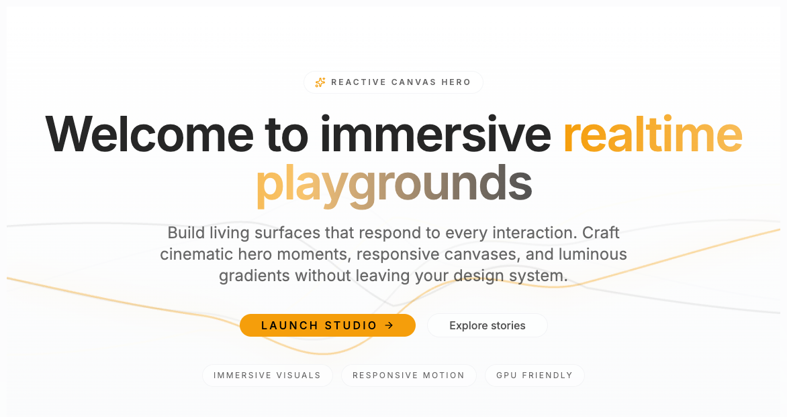

# GlowyWavesHero

A full-screen hero section with animated canvas waves that respond to mouse movement. Features framer-motion text reveals, theme-aware gradient waves, and a stats panel.



## Installation

```bash
npx shadcn@latest add https://raw.githubusercontent.com/o1hive/design-vault/main/registry/glowy-waves-hero-shadcnui.json
```

## Usage

```tsx
import { GlowyWavesHero } from "@/components/blocks/glowy-waves-hero-shadcnui"

export function Page() {
  return <GlowyWavesHero />
}
```

## Props

| Prop | Type | Default | Description |
|------|------|---------|-------------|
| — | — | — | This hero block is a full composition — customize by editing the source |
