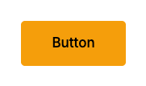

# StarButton

An animated button with floating star particles that scatter on hover.



## Installation

```bash
npx shadcn@latest add https://raw.githubusercontent.com/o1hive/design-vault/main/star-button.json
```

## Usage

```tsx
import { StarButton } from "@/components/ui/buttons/star-button"

export function Example() {
  return <StarButton onClick={() => console.log("clicked")}>Button</StarButton>
}
```

## Props

| Prop | Type | Default | Description |
|------|------|---------|-------------|
| children | `React.ReactNode` | — | Button label content |
| onClick | `() => void` | — | Click handler |
| className | `string` | `""` | Additional CSS classes |
